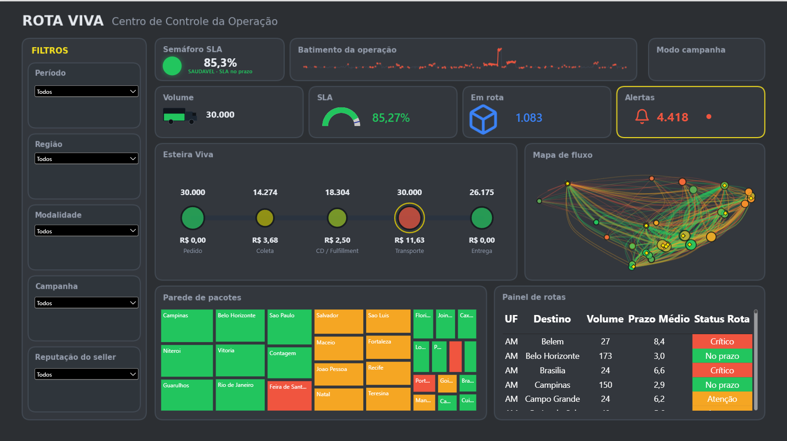
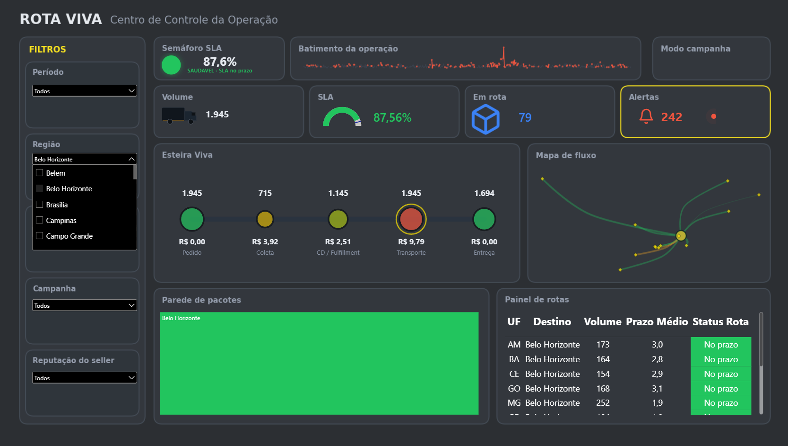
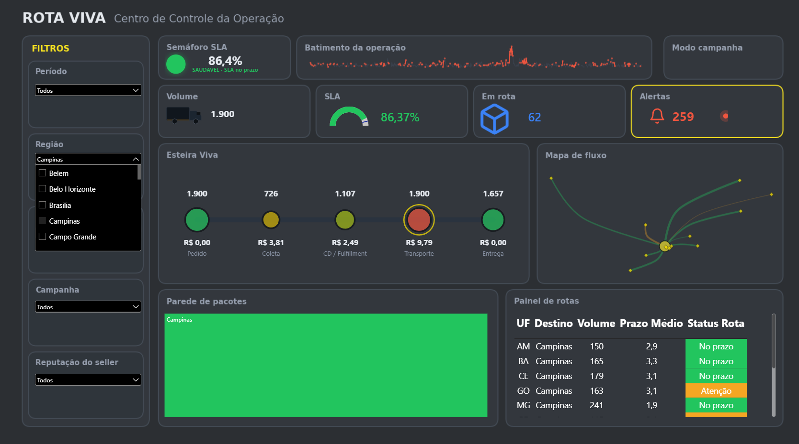

# Rota Viva - Centro de Controle da Operação (Power BI)

Painel gerencial de logística que simula o centro de controle da operação de
entregas de um marketplace. A proposta foi fugir do dashboard tradicional de
cartões e barras e criar algo que a pessoa entende antes de analisar: você bate
o olho e já sabe a saúde da operação pela cor, sem precisar ler número.

> **Projeto pessoal de estudo, com base de dados 100% fictícia gerada em Python.**
> Não é afiliado a nenhuma empresa real. O universo logístico foi usado apenas
> como inspiração conceitual.

## 🎬 Demonstração

## 📊 O painel

Filtrando por uma região, todos os visuais reagem em conjunto:

## 🎯 O projeto

- **Desafio:** transformar dezenas de indicadores logísticos em uma leitura
  imediata da operação, que oriente a decisão sem exigir análise demorada.
- **O que fiz:** modelei os dados em estrela, criei as medidas em DAX e
  construí visuais customizados em Deneb (Vega-Lite) para os componentes que
  não existem nativamente no Power BI.
- **Resultado:** um painel em que a saúde da operação é lida pela cor, com o
  gargalo de custo se acendendo sozinho.

## 🧩 Destaques

- **Esteira Viva:** a jornada do pacote (Pedido, Coleta, CD, Transporte,
  Entrega), com o gargalo de custo se acendendo sozinho. Mostra que o Transporte
  concentra a maior parte do custo logístico.
- **Mapa de fluxo:** arcos das rotas do CD ao destino, com espessura por volume
  e cor por SLA.
- **Treemap volume x SLA:** cada bloco é uma região ou cidade, com tamanho pelo
  volume e cor pelo nível de serviço. Bloco grande e vermelho indica onde agir
  primeiro.
- **Batimento da operação:** o volume diário como um monitor cardíaco, com os
  dias fora da meta em vermelho.
- **KPIs vivos:** SLA, volume e alertas, todos reagindo aos filtros.

## 💡 Insights que o painel entrega

- O Transporte é o gargalo de custo da operação.
- Norte e Nordeste puxam o SLA para baixo.
- O frete grátis opera no vermelho.

Juntos, esses pontos orientam onde investir em capacidade e onde rever subsídio.

## 🛠️ Ferramentas

Power BI · DAX · Modelagem em estrela · Deneb (Vega-Lite)

## 📂 Como abrir

Baixe o arquivo `.pbix` e abra no [Power BI Desktop](https://powerbi.microsoft.com/desktop/) (gratuito).
